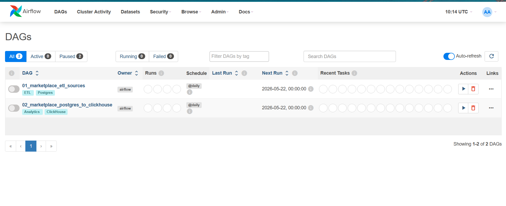
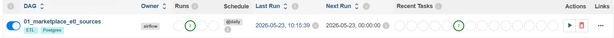

### 1. Какие источники данных выбраны

Для имитации реальных бизнес-процессов маркетплейса были интегрированы два различных внешних источника:

* **Источник 1 (CSV-файл):** Локальный файл `new_pvz.csv`, содержащий адреса новых пунктов выдачи заказов.
* **Источник 2 (Внешний REST API):** Открытое API `dummyjson.com/products`, эмулирующее поступление новых товарных позиций от поставщиков.

### 2. Какие таблицы проекта пополняются

В рамках ETL-процесса обновляются следующие таблицы основной транзакционной базы (PostgreSQL):

* `marketplace.pvz` — пополняется новыми адресами из CSV-файла.
* `marketplace.items` — пополняется новыми товарами, полученными по API.
  *(Дополнительно создаются заглушки в таблицах `shops`, `category_of_item` и `workers` для соблюдения ссылочной целостности Foreign Keys).*

### 3. Как устроен DAG 1 (ETL-сценарий)

* **Название:** `01_marketplace_etl_sources`
* **Логика работы:** Оркестрирует процесс Extract и Load (извлечение и загрузка).
* **Структура:** Состоит из двух параллельных задач `PythonOperator` (`load_csv_pvz` и `load_api_items`).
* Скрипт подключается к источникам (читает файл через `pandas` и делает GET-запрос через `requests`), извлекает данные и выполняет `INSERT` непосредственно в PostgreSQL с использованием библиотеки `psycopg2`.

### 4. Как устроен DAG 2 (Analytics-сценарий)

* **Название:** `02_marketplace_postgres_to_clickhouse`
* **Логика работы:** Выполняет перенос данных из транзакционного контура (OLTP) в аналитическое хранилище (DWH/OLAP).
* **Структура:** Состоит из одной задачи `PythonOperator` (`pg_to_ch_migration`).
* Скрипт выполняет сложный `JOIN` 6-ти таблиц (`purchases`, `items`, `category_of_item`, `shops`, `orders`, `pvz`) на стороне PostgreSQL, собирая данные в широкую плоскую структуру. Затем выгруженные данные отправляются батчем в ClickHouse через `clickhouse_driver`.

### 5. Какие таблицы создаются в ClickHouse

Создана денормализованная широкая таблица фактов:

* `default.fact_sales_wide` — содержит всю необходимую информацию о транзакции в одной строке (ID покупки, дата, название товара, категория, магазин, адрес ПВЗ, количество, сумма, статус).
* Используется движок `ReplacingMergeTree` для возможности фоновой дедупликации данных по ключу сортировки `(purchase_date, purchase_id)`.

### 6. Какая аналитическая витрина построена

Построена аналитическая витрина на базе материализованного представления (Materialized View):

* `default.mart_daily_revenue` — агрегирует данные в режиме реального времени при любой вставке в `fact_sales_wide`.
* Используется движок `SummingMergeTree`, который автоматически суммирует количественные показатели при совпадении ключа `(date, category_name)`.

### 7. Какие метрики считаются

В аналитической витрине рассчитываются следующие бизнес-метрики:

* **`daily_revenue`** — суммарная дневная выручка маркетплейса в разрезе категорий товаров.
* **`items_sold`** — общее количество проданных единиц товаров в день в разрезе категорий.

### 8. Как обеспечена идемпотентность

Система спроектирована так, чтобы повторный запуск DAG (например, при сбое) не приводил к дублированию или искажению данных:

* **В PostgreSQL (DAG 1):** Использована конструкция `ON CONFLICT (уникальный ключ) DO NOTHING`. При повторном запуске существующие товары и ПВЗ просто игнорируются базой.
* **В ClickHouse (DAG 2):** Движок `ReplacingMergeTree` в таблице фактов автоматически заменяет старые строки новыми при совпадении ключа `(purchase_date, purchase_id)`, устраняя возможные дубликаты при повторной миграции данных.

### 9. Какие проверки качества данных реализованы

* **На уровне БД (PostgreSQL):** Схема защищена констрейнтами (например, `CHECK (price >= 0)`, `status IN ('created', 'delivered', 'cancelled')`), что предотвращает попадание некорректных данных на этапе загрузки.
* **На уровне пайплайна (Airflow):** В DAG 2 реализована проверка пустого ответа. Если запрос к PostgreSQL возвращает 0 строк, скрипт выводит информационное сообщение в логи и корректно завершается, предотвращая попытки пустой вставки в ClickHouse.

### 10. Как запустить проект

1. Перейти в директорию `s2/airflow`, содержащую `docker-compose.yml`, и поднять инфраструктуру командой: `docker-compose up -d`. При старте система Flyway автоматически развернет схему в PostgreSQL, а ClickHouse инициализирует аналитические таблицы через проброшенный volume.
2. Перейти в веб-интерфейс Airflow (`localhost:8080`).      
3. Активировать (Unpause) и вручную запустить (Trigger DAG) `01_marketplace_etl_sources`. Дождаться успешного выполнения.
      
4. Сгенерировать тестовые транзакции покупок в базе `marketplace_db` (через SQL-скрипт в DBeaver), чтобы связать загруженные товары с заказами и ПВЗ.
5. В Airflow активировать и запустить `02_marketplace_postgres_to_clickhouse`. Дождаться успешной миграции.
6. Подключиться к ClickHouse и выполнить запрос `SELECT * FROM default.mart_daily_revenue;` для просмотра рассчитанных метрик.