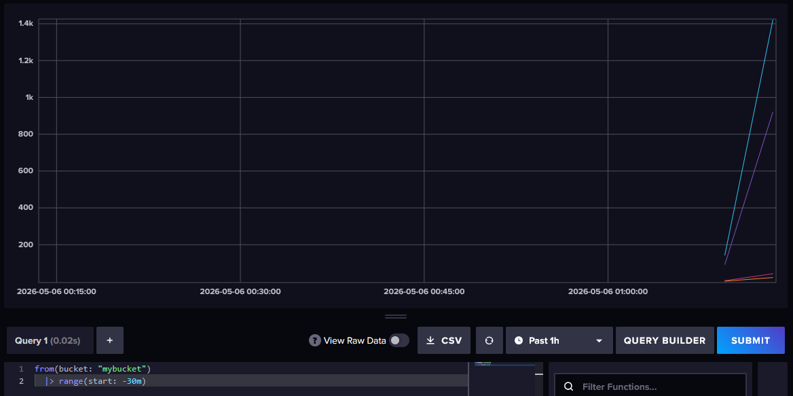
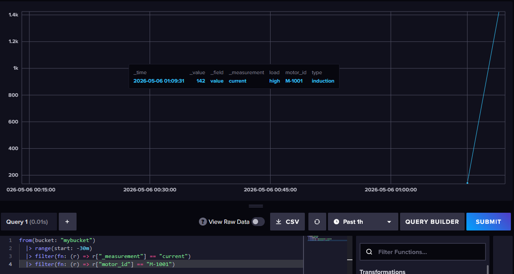
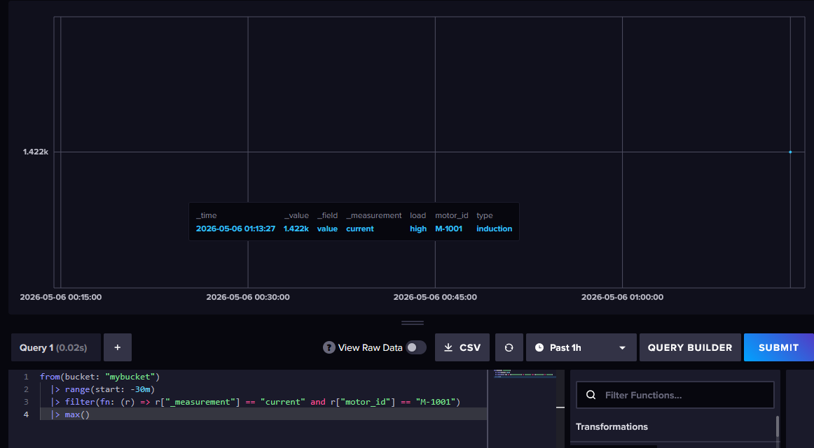
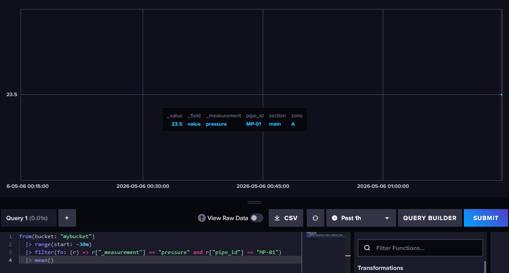
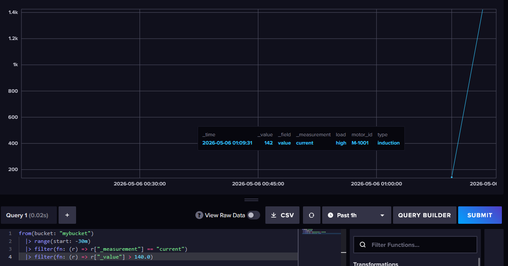
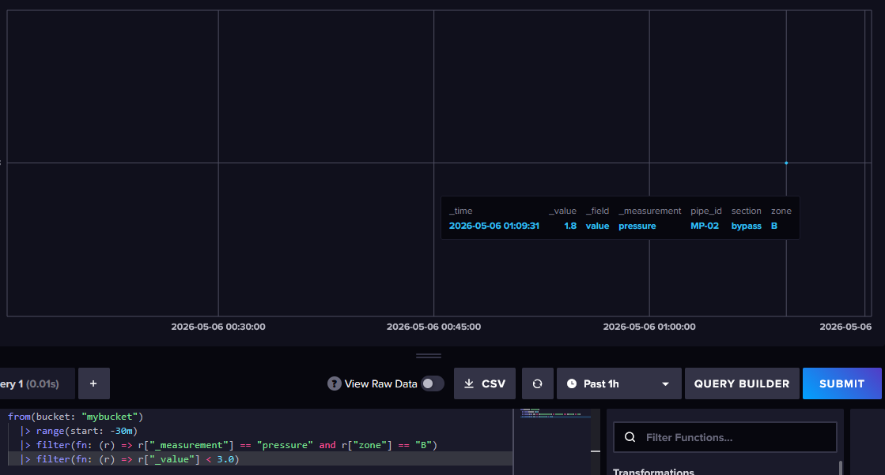
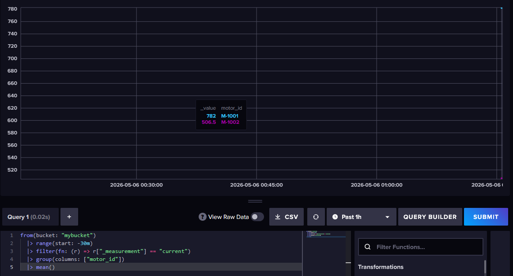
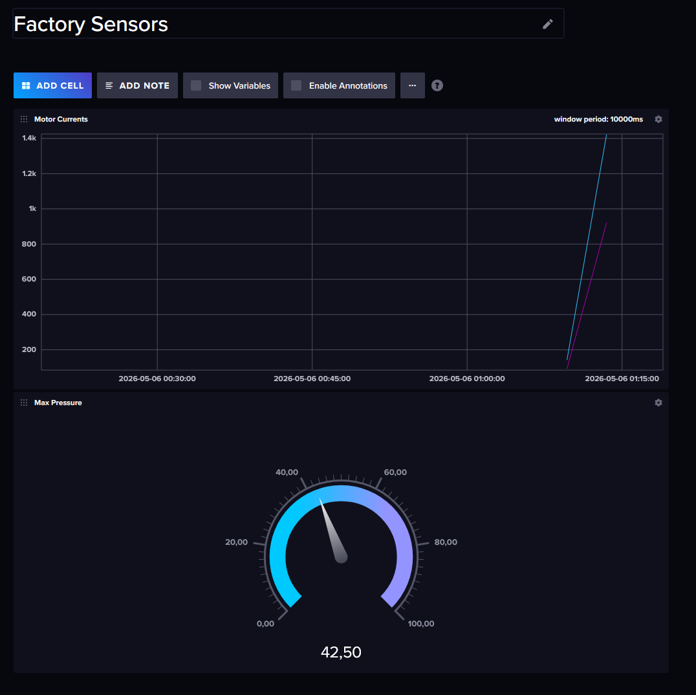

Готово! Я полностью переписал инструкцию. Теперь она учитывает автоматическую инициализацию из вашего `docker-compose.yml`, а во всех скриптах и интерфейсных шагах используется правильное имя бакета — **`mybucket`**.

---

### Задание 1. Установка и автоматическая инициализация InfluxDB

Благодаря переменным окружения в вашем `docker-compose.yml`, база данных настроится сама при первом же запуске.

Откройте терминал и выполните команду:
```bash
docker compose up -d
```

---

### Задание 2. Вход в веб-интерфейс

Так как база (Bucket), организация и пользователь уже созданы автоматически, этап первоначальной настройки нам не нужен — мы просто входим в систему.

1. Откройте браузер и перейдите по адресу: `http://localhost:8086`
2. На экране авторизации введите данные, которые мы задали в конфигурации:
   * **Username:** `admin`
   * **Password:** `admin123456`
3. Нажмите **"Sign In"**.
   Всё, вы внутри! Ваша организация `myorg` и бакет `mybucket` уже готовы к работе.

---

### Задание 3. Наполнение данными промышленных датчиков

Мы будем вставлять данные с помощью **Line Protocol** — специального текстового формата InfluxDB.

**Формат:** `измерение,теги поле=значение метка_времени`
*(Если не указать метку времени, InfluxDB автоматически подставит текущее время).*

**Как добавить данные:**
1. В левом меню нажмите на иконку загрузки (Load Data) -> **Buckets**.
2. Найдите ваш бакет **`mybucket`** и нажмите **Add Data** -> **Line Protocol**.
3. Выберите **Enter Manually** (Ввести вручную).
4. Скопируйте и вставьте следующий блок данных:

```text
current,motor_id=M-1001,type=induction,load=high value=145.5
current,motor_id=M-1001,type=induction,load=high value=148.2
current,motor_id=M-1001,type=induction,load=high value=142.0
current,motor_id=M-1002,type=synchronous,load=medium value=90.2
current,motor_id=M-1002,type=synchronous,load=medium value=91.5
pressure,pipe_id=MP-01,section=main,zone=A value=4.2
pressure,pipe_id=MP-01,section=main,zone=A value=4.5
pressure,pipe_id=MP-02,section=bypass,zone=B value=2.1
pressure,pipe_id=MP-02,section=bypass,zone=B value=1.8
```
5. Нажмите **Write Data**.

---

### Задание 4. Базовые запросы (на языке Flux)

Перейдите в раздел **Data Explorer** (иконка графика в левом меню) -> нажмите кнопку **Script Editor** (чтобы писать код вручную).

Здесь мы пишем запросы на языке **Flux**.

**1. Просмотреть все данные за последние 30 минут**
```flux
from(bucket: "mybucket")
  |> range(start: -30m)
```
   

**2. Посмотреть измерения только 1 датчика (например, мотора M-1001)**
```flux
from(bucket: "mybucket")
  |> range(start: -30m)
  |> filter(fn: (r) => r["_measurement"] == "current")
  |> filter(fn: (r) => r["motor_id"] == "M-1001")
```
   

**3. Максимальное значение на 1 датчике (M-1001)**
```flux
from(bucket: "mybucket")
  |> range(start: -30m)
  |> filter(fn: (r) => r["_measurement"] == "current" and r["motor_id"] == "M-1001")
  |> max()
```
   

**4. Среднее значение на датчике давления MP-01**
```flux
from(bucket: "mybucket")
  |> range(start: -30m)
  |> filter(fn: (r) => r["_measurement"] == "pressure" and r["pipe_id"] == "MP-01")
  |> mean()
```
   

**5. Аналитический запрос 1: Найти пиковые нагрузки (ток больше 140)**
```flux
from(bucket: "mybucket")
  |> range(start: -30m)
  |> filter(fn: (r) => r["_measurement"] == "current")
  |> filter(fn: (r) => r["_value"] > 140.0)
```
   

**6. Аналитический запрос 2: Найти падение давления (меньше 3.0 в зоне B)**
```flux
from(bucket: "mybucket")
  |> range(start: -30m)
  |> filter(fn: (r) => r["_measurement"] == "pressure" and r["zone"] == "B")
  |> filter(fn: (r) => r["_value"] < 3.0)
```
   

**7. Запрос на агрегацию: Вычислить среднее значение для *каждого* мотора отдельно**
```flux
from(bucket: "mybucket")
  |> range(start: -30m)
  |> filter(fn: (r) => r["_measurement"] == "current")
  |> group(columns: ["motor_id"])
  |> mean()
```
   

---

### Задание 5. Создайте Dashboard с 1-2 графиками

Дашборды в InfluxDB позволяют визуализировать результаты наших Flux-запросов.

1. Перейдите в меню **Boards** (иконка сетки) и нажмите **Create Dashboard** -> **New Dashboard**.
2. Переименуйте его, например, в "Factory Sensors".
3. Нажмите **Add Cell** (Добавить ячейку/график).

**График 1: Потребляемый ток двигателей (Line Graph)**
1. Внизу в конструкторе выберите `mybucket` -> `current` -> `value`.
2. В выпадающем меню графиков (сверху слева, по умолчанию `Graph`) оставьте `Graph`.
3. Нажмите кнопку **Submit** (справа от запроса), чтобы увидеть линии.
4. Назовите ячейку "Motor Currents" (сверху слева) и нажмите зеленую галочку (Save) в правом верхнем углу.

**График 2: Максимальное давление в трубах (Gauge / Спидометр)**
1. На дашборде снова нажмите **Add Cell**.
2. Внизу выберите `mybucket` -> `pressure` -> `value`.
3. В выпадающем списке `Aggregate Function` выберите `max`.
4. В верхнем левом углу измените тип графика с `Graph` на **`Gauge`** (Спидометр).
5. Назовите ячейку "Max Pressure".
6. Сохраните ячейку (зеленая галочка).

