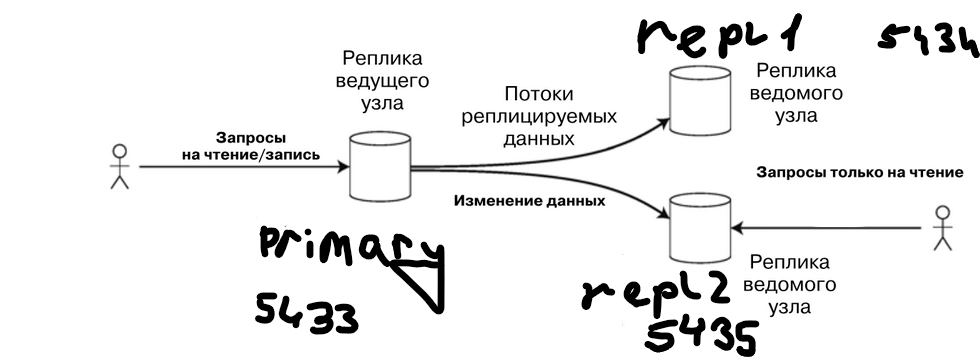

## 1. Рисунок (красивый)


## 2. Проверка физической потоковой репликации данных

```text
  replica1(аналогично для replica2 только порт 5435):
    image: postgres:17
    container_name: replica1
    environment:
      POSTGRES_DB: marketplace_db
      POSTGRES_USER: postgres
      POSTGRES_PASSWORD: qwerty007
    ports:
      - "5434:5432"
    depends_on:
      - postgres
    command: tail -f /dev/null --эту строчку потом уберем
    volumes:
      - pg_replica1_data:/var/lib/postgresql/data
```

```bash
docker compose up -d
```

```bash
docker exec -it replica1 bash -c "rm -rf /var/lib/postgresql/data/*"
docker exec -it replica1 bash -c "PGPASSWORD=pass pg_basebackup -h primary -D /var/lib/postgresql/data -U replicator -P -R"

docker exec -it replica2 bash -c "rm -rf /var/lib/postgresql/data/*"
docker exec -it replica2 bash -c "PGPASSWORD=pass pg_basebackup -h primary -D /var/lib/postgresql/data -U replicator -P -R"
```

```text
  replica1(аналогично для replica2):
    image: postgres:17
    container_name: replica1
    environment:
      POSTGRES_DB: marketplace_db
      POSTGRES_USER: postgres
      POSTGRES_PASSWORD: qwerty007
    ports:
      - "5434:5432"
    depends_on:
      - postgres
      
    --убрали строчку
    
    volumes:
      - pg_replica1_data:/var/lib/postgresql/data
```

```bash
docker compose up -d
```

После настройки кластера была выполнена проверка статуса репликации на Мастере. Оба ведомых узла успешно подключены и находятся в режиме потоковой передачи (streaming):

```bash
docker exec -it primary psql -U postgres -d marketplace_db -c "SELECT client_addr, state, sync_state FROM pg_stat_replication;"
```

```text
 client_addr |   state   | sync_state 
-------------+-----------+------------
 172.19.0.8  | streaming | async
 172.19.0.5  | streaming | async
(2 rows)
```

Проверка репликации данных:
На Мастере была создана тестовая таблица и добавлена одна запись:
```text
CREATE TABLE repl_test (id serial, data text);
INSERT INTO repl_test (data) VALUES ('Hello from Master!');
```

Проверка на репликах подтвердила успешный перенос данных:
```text
# На replica1 и replica2:
SELECT * FROM repl_test;

 id |        data        
----+--------------------
  1 | Hello from Master!
(1 row)
```

Проверка защиты от записи (Read-Only):

```text
docker exec -it replica1 psql -U postgres -d marketplace_db -c "INSERT INTO repl_test (data) VALUES ('Try to insert into replica');"

ERROR:  cannot execute INSERT in a read-only transaction
```

## 3. Анализ replication lag (Задержка репликации)

Для проверки задержки репликации (replication lag) на Мастере была сгенерирована искусственная нагрузка — выполнена массовая вставка 3 000 000 строк в тестовую таблицу.
```bash
docker exec -it primary psql -U postgres -d marketplace_db -c "INSERT INTO repl_test (data) SELECT 'Load test ' || gs FROM generate_series(1, 3000000) AS gs;"
```

В процессе выполнения этой тяжелой транзакции на Мастере регулярно выполнялся запрос для мониторинга отставания реплик в байтах (`pg_wal_lsn_diff`):

```bash
docker exec -it primary psql -U postgres -d marketplace_db -c "SELECT client_addr, state, pg_wal_lsn_diff(pg_current_wal_lsn(), replay_lsn) AS lag_bytes FROM pg_stat_replication;"
```

```text
# Начало нагрузки (появление лага)


client_addr |   state   | lag_bytes
-------------+-----------+-----------
172.19.0.8  | streaming |   9011200
172.19.0.5  | streaming |   9011200

# Пик нагрузки (отставание почти 17 МБ)
client_addr |   state   | lag_bytes
-------------+-----------+-----------
172.19.0.8  | streaming |  16777224
172.19.0.5  | streaming |  16777224

# Снижение нагрузки (реплики начинают догонять мастера)
client_addr |   state   | lag_bytes
-------------+-----------+-----------
172.19.0.8  | streaming |  12435504
172.19.0.5  | streaming |  12435504

# Окончание нагрузки (полная синхронизация)
client_addr |   state   | lag_bytes
-------------+-----------+-----------
172.19.0.8  | streaming |         0
172.19.0.5  | streaming |         0
```

**Вывод:** В обычных условиях физическая репликация работает практически мгновенно. Однако при пиковых нагрузках на запись (DML операции) сеть и диски ведомых узлов могут не успевать за ведущим, что приводит к временной несогласованности данных (replication lag). После прекращения аномальной нагрузки реплики успешно догоняют ведущий узел (Eventual Consistency).

## 4. Настройка логической репликации (PUBLICATION / SUBSCRIPTION)

### 4.1. Подготовка кластера и отвязка реплики
Для работы логической репликации уровень WAL на Мастере в `docker-compose.yml` был изменен с `replica` на `logical`, после чего кластер был перезапущен:
```bash
docker compose up -d
```

Узел `replica2` был отвязан от физической потоковой репликации и переведен в режим самостоятельного сервера с доступом на запись. Для этого на `replica2` была выполнена команда продвижения (promote):
```text
docker exec -it replica2 psql -U postgres -d marketplace_db -c "SELECT pg_promote();"

pg_promote
------------
t
(1 row)
```

Успешный выход из режима восстановления (Read-Only) подтвержден проверкой:
```text
docker exec -it replica2 psql -U postgres -d marketplace_db -c "SELECT pg_is_in_recovery();"

pg_is_in_recovery
-------------------
f
(1 row)
```

### 4.2. Создание публикации и подписки
На ведущем узле (Master) была создана публикация `my_pub` для конкретной таблицы `marketplace.items`. Также системному пользователю `replicator` были выданы необходимые права `USAGE` и `SELECT` для чтения структуры и данных схемы, иначе фоновый процесс логической репликации выдавал бы ошибку доступа:

```text
docker exec -it primary psql -U postgres -d marketplace_db -c "CREATE PUBLICATION my_pub FOR TABLE marketplace.items;"
CREATE PUBLICATION

docker exec -it primary psql -U postgres -d marketplace_db -c "GRANT USAGE ON SCHEMA marketplace TO replicator;"
GRANT

docker exec -it primary psql -U postgres -d marketplace_db -c "GRANT SELECT ON ALL TABLES IN SCHEMA marketplace TO replicator;"
GRANT
```

На узле `replica2` была создана подписка `my_sub`, которая автоматически подключилась к Мастеру по указанным реквизитам:
```text
docker exec -it replica2 psql -U postgres -d marketplace_db -c "CREATE SUBSCRIPTION my_sub CONNECTION 'host=primary port=5432 user=replicator password=pass dbname=marketplace_db' PUBLICATION my_pub;"

NOTICE:  created replication slot "my_sub" on publisher
CREATE SUBSCRIPTION
```

### 4.3. Проверка репликации DML (Data Manipulation Language)
Для проверки работоспособности логической репликации на Мастере была добавлена новая строка:
```text
docker exec -it primary psql -U postgres -d marketplace_db -c "INSERT INTO marketplace.items (shop_id, name, category_id, price) VALUES (1, 'Logical Rep Item', 1, 999.99);"
INSERT 0 1
```

Проверка на подписчике (`replica2`) подтвердила, что данные успешно переданы:
```text
docker exec -it replica2 psql -U postgres -d marketplace_db -c "SELECT * FROM marketplace.items WHERE name = 'Logical Rep Item';"

item_id | shop_id |       name       | description | category_id | price  | tags | metadata
---------+---------+------------------+-------------+-------------+--------+------+----------
300001 |       1 | Logical Rep Item |             |           1 | 999.99 |      |
(1 row)
```

### 4.4. Проверка нереплицируемости DDL (Data Definition Language)
Главным отличием логической репликации от физической является отсутствие автоматического переноса изменений структуры базы данных. Для проверки этого факта на Мастере была добавлена новая колонка:
```text
docker exec -it primary psql -U postgres -d marketplace_db -c "ALTER TABLE marketplace.items ADD COLUMN logical_test_col TEXT;"
ALTER TABLE
```

Сравнение структуры таблиц подтвердило, что новая колонка `logical_test_col` успешно создалась на Мастере, но **не перенеслась** на узел-подписчик (`replica2`):

```text
-- Вывод структуры на Мастере (колонка присутствует):
docker exec -it primary psql -U postgres -d marketplace_db -c "d marketplace.items"

                                               Table "marketplace.items"
      Column      |          Type          | Collation | Nullable |                      Default
------------------+------------------------+-----------+----------+----------------------------------------------------
 item_id          | integer                |           | not null | nextval('marketplace.items_item_id_seq'::regclass)
 shop_id          | integer                |           | not null |
 name             | character varying(255) |           | not null |
 description      | text                   |           |          |
 category_id      | integer                |           | not null |
 price            | numeric(10,2)          |           | not null |
 tags             | text[]                 |           |          |
 metadata         | jsonb                  |           |          |
 logical_test_col | text                   |           |          |


-- Вывод структуры на Replica 2 (отсутствует колонка logical_test_col):
docker exec -it replica2 psql -U postgres -d marketplace_db -c "d marketplace.items"

                                            Table "marketplace.items"
   Column    |          Type          | Collation | Nullable |                      Default
-------------+------------------------+-----------+----------+----------------------------------------------------
 item_id     | integer                |           | not null | nextval('marketplace.items_item_id_seq'::regclass)
 shop_id     | integer                |           | not null |
 name        | character varying(255) |           | not null |
 description | text                   |           |          |
 category_id | integer                |           | not null |
 price       | numeric(10,2)          |           | not null |
 tags        | text[]                 |           |          |
 metadata    | jsonb                  |           |          |
```

### 4.5. Проверка REPLICA IDENTITY (Таблица без первичного ключа)
Логическая репликация построена на передаче конкретных операций (INSERT, UPDATE, DELETE). Для выполнения UPDATE или DELETE ведомому узлу необходимо точно идентифицировать строку. По умолчанию для этого используется Primary Key (Replica Identity = DEFAULT)

Для проверки поведения системы при отсутствии первичного ключа была создана тестовая таблица `no_pk_test`:

```text
-- Создание таблицы без PK и добавление в публикацию (Master):
docker exec -it primary psql -U postgres -d marketplace_db -c "CREATE TABLE no_pk_test (id int, data text);"
docker exec -it primary psql -U postgres -d marketplace_db -c "ALTER PUBLICATION my_pub ADD TABLE no_pk_test;"

-- Создание структуры на реплике и обновление подписки (Replica 2):
docker exec -it replica2 psql -U postgres -d marketplace_db -c "CREATE TABLE no_pk_test (id int, data text);"
docker exec -it replica2 psql -U postgres -d marketplace_db -c "ALTER SUBSCRIPTION my_sub REFRESH PUBLICATION;"
```

Операция **INSERT** отработала успешно, так как для вставки новой строки идентификация старых данных не требуется:
```text
docker exec -it primary psql -U postgres -d marketplace_db -c "INSERT INTO no_pk_test VALUES (1, 'Test data');"
INSERT 0 1
```

Однако попытка выполнить операцию **UPDATE** на Мастере ожидаемо привела к ошибке. База данных заблокировала транзакцию, так как без Primary Key (или настройки `REPLICA IDENTITY FULL`) она не может безопасно передать реплике инструкцию о том, какую именно строку нужно обновить:
```text
docker exec -it primary psql -U postgres -d marketplace_db -c "UPDATE no_pk_test SET data = 'Updated data' WHERE id = 1;"

ERROR:  cannot update table "no_pk_test" because it does not have a replica identity and publishes updates
HINT:  To enable updating the table, set REPLICA IDENTITY using ALTER TABLE.
```

### 4.6. Проверка статуса логической репликации (Replication status)
Мониторинг логической репликации осуществляется через системные представления как на стороне публикатора, так и на стороне подписчика.

**Статус на стороне Подписчика (Replica 2):**
Представление `pg_stat_subscription` показывает статус фонового процесса применения данных
```text
docker exec -it replica2 psql -U postgres -d marketplace_db -c "SELECT subname, pid, worker_type FROM pg_stat_subscription;"

 subname | pid | worker_type 
---------+-----+-------------
 my_sub  |  67 | apply
(1 row)
```

**Статус на стороне Мастера (Primary):**
Представление `pg_stat_replication` отображает подключенный процесс walsender, который читает WAL и отправляет логические изменения подписчику
```text
docker exec -it primary psql -U postgres -d marketplace_db -c "SELECT application_name, state, sync_state FROM pg_stat_replication WHERE application_name = 'my_sub';"

application_name |   state   | sync_state
------------------+-----------+------------
my_sub           | streaming | async
(1 row)
```

### 4.7. Роль утилит pg_dump / pg_restore при логической репликации
Логическая репликация переносит исключительно данные (DML), но не структуру таблиц (DDL).

Именно поэтому стандартные утилиты резервного копирования `pg_dump` и `pg_restore` играют критически важную роль при инициализации логической подписки:
1. Перед созданием подписки (SUBSCRIPTION) на целевом сервере должны существовать таблицы с идентичной структурой.
2. Использование утилиты с флагом `--schema-only` (`pg_dump -h primary -U postgres -s -d marketplace_db`) позволяет быстро и безошибочно выгрузить всю структуру (DDL) с Мастера.
3. Затем эта структура разворачивается на Реплике с помощью `pg_restore` (-Fc) (или просто через `cat schema_dump.sql | docker exec -i replica2 psql -U postgres -d marketplace_db` если дамп просто в текстовый файл `.sql` -Fp).
4. Только после полного переноса DDL-схемы можно безопасно запускать логическую подписку для переноса самих данных.