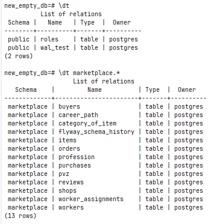

### Пункт 2. Посмотреть на изменение LSN и WAL

**Шаг 2.a: Сравнение LSN до и после INSERT**

```sql
CREATE TABLE wal_test (id serial, data text);
```

```sql
SELECT pg_current_wal_lsn() AS lsn_before;
```

**Результат:**

| lsn_before |
| :--- |
| 0/35DA8CD8 |

```sql
INSERT INTO wal_test (data) VALUES ('test_data_1');

SELECT pg_current_wal_lsn() AS lsn_after;
```

**Результат:**

| lsn_after |
| :--- |
| 0/35DA8DE8 |

**Шаг 2.b: Сравнение WAL до и после COMMIT**

```sql
BEGIN;
SELECT pg_current_wal_lsn() AS lsn_start, pg_walfile_name(pg_current_wal_lsn()) AS wal_file;

INSERT INTO wal_test (data) VALUES ('test_data_2');

SELECT
    pg_current_wal_insert_lsn() AS lsn_uncommitted_ram,
    pg_current_wal_lsn() AS lsn_uncommitted_disk;

COMMIT;

SELECT pg_current_wal_lsn() AS lsn_committed;
```

**До коммита:**

| lsn_start  | wal_file |
|:-----------| :--- |
| 0/36AB9D70 | 000000010000000000000036 |

| lsn_uncommitted_disk | lsn_uncommitted_ram |
|:---------------------|:--------------------|
| 0/36AB9D70           | 0/36ABBCB0          |

**После коммита:**

| lsn_committed |
|:--------------|
| 0/36ABBD10    |

**Шаг 2.c: Анализ размера WAL после массовой операции**

**До:** 

```sql
SELECT pg_current_wal_lsn() AS lsn_mass_start;
```

| lsn_mass_start |
| :--- |
| 0/35DA8FD0 |

**После:** 

```sql
INSERT INTO wal_test (data) SELECT 'mass_data_' || gs FROM generate_series(1, 100000) gs;

SELECT pg_current_wal_lsn() AS lsn_mass_end;
```

| lsn_mass_end |
| :--- |
| 0/3659CE80 |

**Результат:**

```sql
SELECT pg_size_pretty(pg_wal_lsn_diff('0/3659CE80', '0/35DA8FD0')) AS wal_size_generated;
```

| wal_size_generated |
| :--- |
| 8144 kB |

-----

### Пункт 3. Сделать дамп БД

**Шаг 3.a: Dump только структуры базы (-s) (Результат в schema_dump.sql)**

```bash
docker exec marketplace_db pg_dump -U postgres -d marketplace_db -s -Fp > schema_dump.sql
```

**Шаг 3.b: Dump одной таблицы (-t) (Результат в table_dump.sql)**

```bash
docker exec marketplace_db pg_dump -U postgres -d marketplace_db -t wal_test -Fp > table_dump.sql
```

**Накатываем на чистую БД:**

```bash
docker exec marketplace_db psql -U postgres -c "CREATE DATABASE new_empty_db;"

cat schema_dump.sql | docker exec -i marketplace_db psql -U postgres -d new_empty_db
```




### Пункт 4. Создать несколько seed (Идемпотентность)

```sql
CREATE TABLE roles (
    role_id int PRIMARY KEY,
    role_name varchar(50) UNIQUE
);

INSERT INTO roles (role_id, role_name) VALUES 
(1, 'Admin'), 
(2, 'Manager'), 
(3, 'User')
ON CONFLICT (role_id) DO NOTHING;

SELECT * FROM roles;
```

**Результат:**

| role_id | role_name |
| :--- | :--- |
| 1 | Admin |
| 2 | Manager |
| 3 | User |

```sql
INSERT INTO roles (role_id, role_name) VALUES
(1, 'Admin'),
(2, 'Manager'),
(3, 'User'),
(4, 'Guest')
ON CONFLICT (role_id) DO NOTHING;

SELECT * FROM roles;
```

**Результат:**

| role_id | role_name |
| :--- | :--- |
| 1 | Admin |
| 2 | Manager |
| 3 | User |
| 4 | Guest |

**Пример 2. Идемпотентность через ON CONFLICT DO UPDATE**

**Создание таблицы и первичный seed:**

```sql
CREATE TABLE system_settings (
    setting_key varchar(50) PRIMARY KEY,
    setting_value text
);

INSERT INTO system_settings (setting_key, setting_value) VALUES 
('maintenance_mode', 'false'), 
('max_users', '100')
ON CONFLICT (setting_key) DO UPDATE SET setting_value = EXCLUDED.setting_value;

SELECT * FROM system_settings;
```

**Результат:**

| setting_key | setting_value |
| :--- | :--- |
| maintenance_mode | false |
| max_users | 100 |

**Повторный запуск:**

```sql
INSERT INTO system_settings (setting_key, setting_value) VALUES 
('maintenance_mode', 'false'), 
('max_users', '200'), -- Изменили значение
('theme', 'dark')     -- Добавили новую настройку
ON CONFLICT (setting_key) DO UPDATE SET setting_value = EXCLUDED.setting_value;

SELECT * FROM system_settings;
```

**Результат после повторного seed-скрипта:**

| setting_key | setting_value |
| :--- | :--- |
| maintenance_mode | false |
| max_users | 200 |
| theme | dark |